# Web Presence

<div align="center">
  

  <h2>Share your browsing activity on Discord</h2>

  <p align="center">
    <b>Web Presence shows your friends what websites you're browsing in real-time through Discord Rich Presence.</b><br>
    It's easy to set up and works with most popular websites!
  </p>

  <p>
    <a href="#features">Features</a> •
    <a href="#quick-install-guide">Quick Install</a> •
    <a href="#need-help">Documentation</a> •
    <a href="#for-developers">For Developers</a>
  </p>

  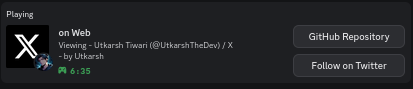
</div>

## What is Web Presence?

Web Presence is a simple tool that shows your current website in your Discord profile. When you browse websites like YouTube, GitHub, or Twitter, your Discord profile will display what you're doing with custom icons for each site.

<table border="0" cellspacing="0" cellpadding="0" style="border: none; width: 100%;">
  <tr style="border: none;">
    <td style="border: none; padding: 10px; vertical-align: middle;">
      <h3>✨ Key Benefits</h3>
      <ul>
        <li>Show off what content you're enjoying</li>
        <li>Let friends know what you're working on</li>
        <li>Discover shared interests with others</li>
        <li>Express yourself through your browsing habits</li>
      </ul>
    </td>
    <td style="border: none; padding: 10px; vertical-align: middle;">
      <h3>🔐 Privacy First</h3>
      <ul>
        <li>Full control over what sites are shared</li>
        <li>Easy to toggle on/off with one click</li>
        <li>Blacklist specific domains you want to keep private</li>
        <li>No data collection or tracking</li>
      </ul>
    </td>
  </tr>
</table>

## Features

<div align="center">
  <table border="0" cellspacing="0" cellpadding="0" style="border: none;">
    <tr style="border: none;">
      <td align="center" width="50%" style="border: none; padding: 10px;">
        <div style="padding: 15px; height: 100%;">
          <h3>🌐 Shows your current website</h3>
          <p>Your Discord profile displays the website you're currently browsing with elapsed time</p>
          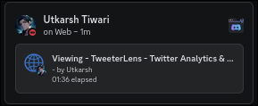
        </div>
      </td>
      <td align="center" width="50%" style="border: none; padding: 10px;">
        <div style="padding: 15px; height: 100%;">
          <h3>🎮 Custom icons for popular sites</h3>
          <p>Unique icons for YouTube, GitHub, Twitter, and 100+ popular websites</p>
          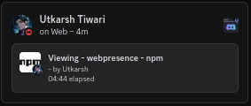
        </div>
      </td>
    </tr>
    <tr style="border: none;">
      <td align="center" width="50%" style="border: none; padding: 10px;">
        <div style="padding: 15px; height: 100%;">
          <h3>🔒 Privacy controls</h3>
          <p>Easily turn presence on/off or disable for specific sites</p>
          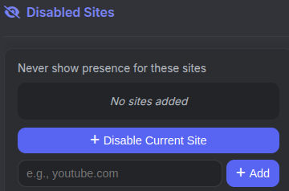
        </div>
      </td>
      <td align="center" width="50%" style="border: none; padding: 10px;">
        <div style="padding: 15px; height: 100%;">
          <h3>🧩 Browser extension</h3>
          <p>Simple browser extension for Chrome and Firefox</p>
          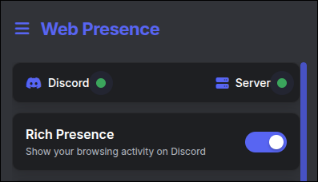
        </div>
      </td>
    </tr>
  </table>
</div>

### Additional Features

- ⏱️ **Timer persistence** - Keep elapsed time when switching between tabs
- 🔄 **Auto-updates** - Server checks for updates automatically
- 🌙 **Always-on sites** - Configure sites to always show presence even when globally disabled
- 🖥️ **Cross-platform** - Works on Windows, Mac, and Linux
- 🛠️ **Customizable** - Use your own Discord application and icons

## 🚀 Quick Install Guide

### Step 1: Install the Server

<table>
<tr>
<td width="60%">

```bash
# Install with npm (make sure you have Node.js installed)
npm install -g webpresence

# Start the server in daemon mode (runs in background)
webpresence start -d

# Configure to start automatically on system boot
webpresence autostart --enable

# Check if server is running
webpresence status
```

> **Tip:** Using daemon mode (`-d`) lets the server run in the background so you can close your terminal window!

</td>
<td width="40%">
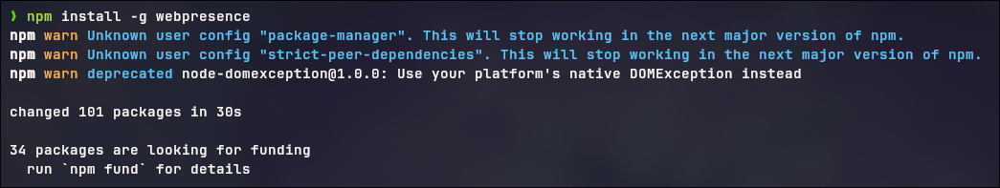
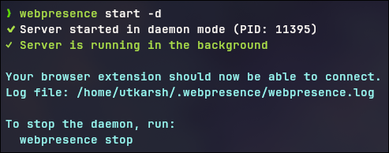
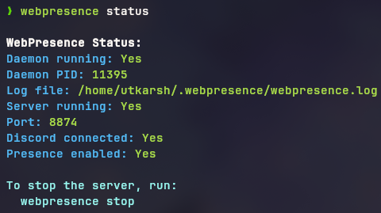
</td>
</tr>
</table>

### Step 2: Install the Browser Extension

<table>
<tr>
<td width="60%">

#### Option 1: Download the Source Code

First, get the extension files by either:

**Cloning the repository:**

```bash
git clone https://github.com/utkarshthedev/webpresence.git
```

**Or downloading as ZIP:**

1. Go to [GitHub Repository](https://github.com/utkarshthedev/webpresence)
2. Click the green "Code" button
3. Select "Download ZIP"
4. Extract the ZIP file to a location on your computer

#### For Chrome:

1. Go to `chrome://extensions/`
2. Turn on "Developer mode" (top-right corner)
3. Click "Load unpacked" and select the `client/chrome` folder

#### For Firefox:

1. Go to `about:debugging#/runtime/this-firefox`
2. Click "Load Temporary Add-on..."
3. Select the `manifest.json` file from the `client/firefox` folder

</td>
<td width="40%">
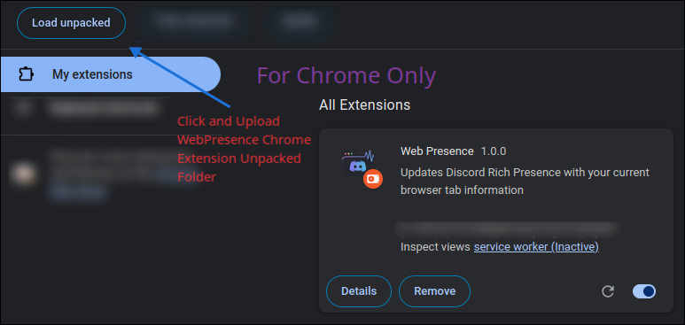
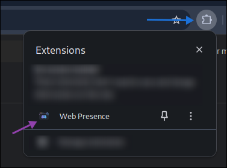
</td>
</tr>
</table>

### Step 3: Start Using It!

<table>
<tr>
<td width="60%">

1. Make sure Discord is open on your computer
2. Click the Web Presence icon in your browser
3. Toggle the switch to turn it on
4. Start browsing - your activity will show in Discord!

<p><a href="docs/INSTALLATION.md"><strong>📚 Need more detailed instructions?</strong></a> Check out our comprehensive installation guide!</p>

</td>
<td width="40%">

</td>
</tr>
</table>

## 🆘 Need Help?

### 📚 Documentation

- [**Installation Guide**](docs/INSTALLATION.md) - Step-by-step setup instructions for beginners
- [**Autostart Configuration**](docs/AUTOSTART.md) - Make Web Presence start automatically on boot
- [**Troubleshooting**](docs/TROUBLESHOOTING.md) - Solutions to common problems
- [**CLI Guide**](docs/CLI.md) - All command-line features explained
- [**All Documentation**](docs/index.md) - Complete documentation index

Our comprehensive documentation helps you get the most out of Web Presence!

### 🔍 Common Questions

- **How do I start the server?**
  Run `webpresence start -d` in your terminal

- **How do I check if it's running?**
  Run `webpresence status` to see server status

- **Can I disable for specific sites?**
  Yes, click the extension icon and use the site settings

- **Does it work with all websites?**
  Yes, with custom icons for 100+ popular sites

- **How do I update Web Presence?**
  Run `npm update -g webpresence` to get the latest version

**Still stuck?** Check the [Troubleshooting Guide](docs/TROUBLESHOOTING.md) for solutions to common issues.

## 👨‍💻 For Developers

### 🛠️ Contribute

We welcome contributions of all kinds:

- **Add new website icons** - Help expand our collection of custom site icons
- **Improve documentation** - Make guides clearer and more helpful
- **Fix bugs and add features** - Enhance functionality and stability
- **Report issues** - Help identify problems that need fixing
- **Improve performance** - Optimize code for better efficiency

Every contribution helps make Web Presence better!

#### Getting Started

1. Fork the repository
2. Create a feature branch
3. Make your changes
4. Submit a pull request

### 📋 Developer Resources

- [**Contributing Guide**](CONTRIBUTING.md) - Detailed instructions for contributors
- [**Site Icons Guide**](docs/SITE_ICONS.md) - How to add new website icons
- [**CLI Reference**](docs/CLI.md) - All command-line options
- [**API Documentation**](docs/API.md) - Server API reference
- [**Server Package**](server/README.md) - WebPresence npm package details

### Project Structure

The codebase is organized into two main components:

**Server** - Node.js application that connects to Discord

- `server/src/` - Server source code
- `server/config/` - Configuration files
- `server/data/` - Site icons and assets

**Client** - Browser extension that communicates with the server

- `client/chrome/` - Chrome extension
- `client/firefox/` - Firefox extension
- `client/shared/` - Shared code between browsers

### Development Workflow

To set up a development environment:

1. Clone the repository
2. Install dependencies with `npm install`
3. Run the server in dev mode with `npm run dev`
4. Load the extension in your browser

**Want to contribute?** Check out our [open issues](https://github.com/utkarshthedev/webpresence/issues) to find something to work on!

## Using Your Own Discord Application

You can use your own Discord application instead of the default one:

1. Create a new application at the [Discord Developer Portal](https://discord.com/developers/applications)
2. Copy your Client ID
3. Replace the `clientId` in `server/config.ts`
4. Upload custom icons to your Discord application

This allows you to customize the appearance of your presence with your own branding and icons.

## Showcase

<div align="center">
  <h3>Web Presence in action on popular websites</h3>

  <table border="0" cellspacing="0" cellpadding="0" style="border: none;">
    <tr style="border: none;">
      <td align="center" width="50%" style="border: none; padding: 10px;">
        <div style="padding: 10px; height: 100%;">
          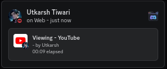
          <p><strong>YouTube</strong> - Watch videos with style</p>
        </div>
      </td>
      <td align="center" width="50%" style="border: none; padding: 10px;">
        <div style="padding: 10px; height: 100%;">
          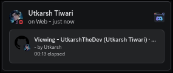
          <p><strong>GitHub</strong> - Show off your coding sessions</p>
        </div>
      </td>
    </tr>
    <tr style="border: none;">
      <td align="center" width="50%" style="border: none; padding: 10px;">
        <div style="padding: 10px; height: 100%;">
          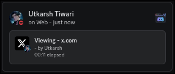
          <p><strong>Twitter/X</strong> - Share your social media browsing</p>
        </div>
      </td>
      <td align="center" width="50%" style="border: none; padding: 10px;">
        <div style="padding: 10px; height: 100%;">
          
          <p><strong>Any Website</strong> - Works with any site you visit</p>
        </div>
      </td>
    </tr>
  </table>
</div>

## Project Information

<div align="center">
  <table border="0" cellspacing="0" cellpadding="0" style="border: none; width: 100%;">
    <tr style="border: none;">
      <td align="center" width="33%" style="border: none; padding: 10px;">
        <h3>📄 License</h3>
        <p>MIT License</p>
        <p><a href="LICENSE">View License</a></p>
      </td>
      <td align="center" width="33%" style="border: none; padding: 10px;">
        <h3>📝 Changelog</h3>
        <p>Version history</p>
        <p><a href="server/CHANGELOG.md">View Changelog</a></p>
      </td>
      <td align="center" width="33%" style="border: none; padding: 10px;">
        <h3>👤 Author</h3>
        <p>Made with ❤️ by</p>
        <p><a href="https://github.com/utkarshthedev">Utkarsh Tiwari</a></p>
      </td>
    </tr>
  </table>

  <p>If you find this project useful, please consider <a href="https://github.com/utkarshthedev/webpresence">⭐ starring it on GitHub</a>!</p>
</div>
