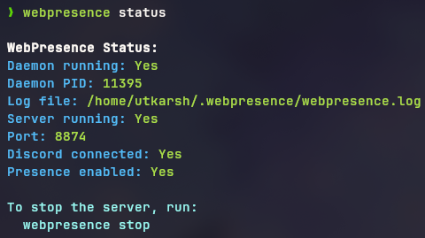
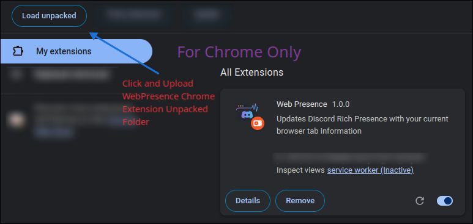

# 📥 Installation Guide

<div align="center">
  
  <p><i>Follow this step-by-step guide to get Web Presence up and running</i></p>
</div>

This comprehensive guide will walk you through installing Web Presence from start to finish, with detailed instructions for both beginners and advanced users.

## 📋 What You'll Need

- A computer with Windows, macOS, or Linux
- Discord desktop app installed and running
- A web browser (Chrome or Firefox)
- Basic knowledge of using the command line (for server installation)

## 🔍 Overview of Installation Process

Web Presence consists of two main components:

1. **Server**: Connects to Discord and updates your presence
2. **Browser Extension**: Sends your current website to the server

Both components need to be installed for Web Presence to work properly.

## 🖥️ Step 1: Install the Server

The server is the part that connects your browser to Discord. You have two options:

### Option A: Using npm package (Recommended for beginners)

This is the easiest way to install Web Presence.

<details open>
<summary><b>Step-by-step instructions</b></summary>

1. **Install Node.js** (version 16 or higher)

   - Download from [nodejs.org](https://nodejs.org/) (choose the "LTS" version)
   - Follow the installation instructions for your operating system
   - To verify installation, open a terminal/command prompt and type:
     ```bash
     node -v
     ```
   - You should see a version number like `v16.15.0` or higher

2. **Install the Web Presence package globally**

   ```bash
   npm install -g webpresence
   ```

   This command installs the Web Presence server on your computer so it can be run from anywhere.

3. **Start the server in daemon mode** (recommended)

   ```bash
   webpresence start -d
   ```

   You should see a message indicating the server has started successfully.

4. **Configure autostart** (optional but recommended)

   ```bash
   webpresence autostart --enable
   ```

   This makes Web Presence start automatically when you turn on your computer.

5. **Verify the server is running**

   ```bash
   webpresence status
   ```

   You should see a message confirming the server is running and connected to Discord.

</details>

<div align="center">
  
  <p><i>Example of a successful server status check</i></p>
</div>

> **What is daemon mode?**
>
> Daemon mode (using the `-d` flag) runs the server in the background, so you can close your terminal window and the server will keep running. This is the recommended way to run Web Presence.
>
> **What is autostart?**
>
> Autostart configures Web Presence to start automatically when your computer boots up, ensuring Discord presence is always available without manual intervention. See the [Autostart Configuration](./AUTOSTART.md) guide for more details.

### Option B: Installing from source code

If you want to modify the code or contribute to the project, you can install from source:

<details>
<summary><b>Step-by-step instructions for developers</b></summary>

1. **Install Git** (if not already installed)

   - Download from [git-scm.com](https://git-scm.com/downloads)
   - Follow the installation instructions for your operating system

2. **Clone the repository**

   - Open a terminal/command prompt
   - Navigate to where you want to download the code
   - Run the following commands:

   ```bash
   git clone https://github.com/utkarshthedev/webpresence.git
   cd webpresence
   ```

3. **Install and start the server**

   ```bash
   cd server
   npm install
   npm start
   ```

   This will start the server in the foreground. Keep the terminal window open while using Web Presence.

4. **For development mode with auto-reload**
   ```bash
   npm run dev
   ```

</details>

## 🧩 Step 2: Install the Browser Extension

### Option A: Download and Install from Source (Recommended)

<details open>
<summary><b>Step-by-step instructions</b></summary>

1. **Download the extension files**

   - If you haven't already, clone the repository:

   ```bash
   git clone https://github.com/utkarshthedev/webpresence.git
   ```

   - Or download as ZIP from GitHub:
     1. Go to [https://github.com/utkarshthedev/webpresence](https://github.com/utkarshthedev/webpresence)
     2. Click the green "Code" button
     3. Select "Download ZIP"
     4. Extract the ZIP file to a location on your computer

2. **Install in Chrome**

   - Open Chrome and type `chrome://extensions/` in the address bar
   - Toggle on "Developer mode" in the top-right corner
   - Click "Load unpacked" button
   - Navigate to the `client/chrome` directory in the Web Presence folder
   - Click "Select Folder"
   - The Web Presence extension icon will appear in your toolbar

3. **Install in Firefox**
   - Open Firefox and type `about:debugging#/runtime/this-firefox` in the address bar
   - Click "Load Temporary Add-on..."
   - Navigate to the `client/firefox` directory and select the `manifest.json` file
   - The Web Presence extension icon will appear in your toolbar

</details>

<div align="center">
  
  <p><i>Chrome extension installation screen</i></p>
</div>

### Option B: Publishing Your Own Extension (Advanced)

If you want to create your own version of the extension for personal use or distribution:

<details>
<summary><b>For Chrome Web Store</b></summary>

1. **Prepare your extension**

   - Make any desired modifications to the code
   - Update the `manifest.json` file with your own extension details

2. **Create a ZIP file**

   - Select all files in the `client/chrome` directory
   - Create a ZIP archive of these files

3. **Create a developer account**

   - Go to the [Chrome Web Store Developer Dashboard](https://chrome.google.com/webstore/devconsole/)
   - Sign in with your Google account
   - Pay the one-time developer registration fee ($5 USD) if you haven't already

4. **Upload your extension**

   - Click "New Item" in the dashboard
   - Upload the ZIP file you created
   - Fill out all required information:
     - Description
     - Screenshots (at least one)
     - Icon
     - Category (Productivity recommended)
     - Privacy practices
   - Submit for review

5. **Wait for approval**
   - Chrome Web Store team will review your extension
   - This typically takes 1-3 business days
   - Once approved, your extension will be published to the store

</details>

<details>
<summary><b>For Firefox Add-ons</b></summary>

1. **Prepare your extension**

   - Make any desired modifications to the code
   - Ensure the `manifest.json` file has the correct version (at least 79.0)
   - Update extension details as needed

2. **Create a ZIP file**

   - Select all files in the `client/firefox` directory
   - Create a ZIP archive of these files

3. **Create a developer account**

   - Go to [Firefox Add-on Developer Hub](https://addons.mozilla.org/en-US/developers/)
   - Sign in with a Firefox account or create one

4. **Upload your add-on**

   - Click "Submit a New Add-on"
   - Choose "On this site" for distribution channel
   - Upload the ZIP file you created
   - Fill out all required information:
     - Name
     - Description
     - Categories
     - Screenshots
   - Submit for review

5. **Wait for approval**
   - Mozilla team will review your add-on
   - This typically takes 1-2 weeks
   - Once approved, your add-on will be published to the Firefox Add-ons store

</details>

## ✅ Step 3: Verify Everything Works

1. **Make sure Discord is open** on your computer
2. **Click the Web Presence extension icon** in your browser
3. **Toggle the switch** to enable Discord presence
4. **Visit a website** (like YouTube or GitHub)
5. **Check your Discord profile** - you should see your browsing activity displayed

<div align="center">
  
  <p><i>Your Discord profile should now show your current website</i></p>
</div>

## 🔄 Updating Web Presence

To update to the latest version:

```bash
# Update the npm package
npm update -g webpresence

# Restart the server
webpresence stop
webpresence start -d
```

For source installations, pull the latest changes:

```bash
cd webpresence
git pull
cd server
npm install
npm run build
```

## 🛠️ Troubleshooting

If something isn't working:

1. **Check Discord is running**

   - The Discord desktop app must be open for presence to work

2. **Verify the server is running**

   ```bash
   webpresence status
   ```

3. **Check server logs**

   ```bash
   webpresence logs
   ```

4. **Restart the server**

   ```bash
   webpresence stop
   webpresence start -d
   ```

5. **Check browser extension**
   - Make sure the extension is enabled in your browser
   - Try clicking the extension icon and toggling presence off and on

For more detailed troubleshooting, see the [Troubleshooting Guide](./TROUBLESHOOTING.md).

## 🚀 Next Steps

- Learn about the [CLI commands](./CLI.md) to control Web Presence
- Customize your settings through the extension popup
- Configure [autostart](./AUTOSTART.md) for convenience
- Check out how to [contribute](../CONTRIBUTING.md) to the project
