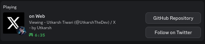

# 🌐 WebPresence

<div align="center">
  

  <h2>Discord Rich Presence for Websites</h2>

  <p>
    <b>Show your browsing activity in Discord with custom icons for popular websites</b>
  </p>

  <p>
    <a href="#-installation">Installation</a> •
    <a href="#-usage">Usage</a> •
    <a href="#-features">Features</a> •
    <a href="#-api-reference">API Reference</a> •
    <a href="#-development">Development</a>
  </p>
</div>

## ✨ What is WebPresence?

WebPresence is a Node.js package that connects your browser to Discord, showing your current website in your Discord profile. When you browse websites like YouTube, GitHub, or Twitter, your Discord profile displays what you're doing with custom icons for each site.

<div align="center">
  
</div>

## 🚀 Installation

### Prerequisites

- [Node.js](https://nodejs.org/) (version 16 or higher)
- Discord desktop application

### Option 1: Install as a Package (Recommended)

```bash
# Install globally
npm install -g webpresence

# Start the server
webpresence start

# Or start in daemon mode (runs in background)
webpresence start -d
```

### Option 2: Install from Source

```bash
# Clone the repository
git clone https://github.com/utkarshthedev/webpresence.git
cd webpresence/server

# Install dependencies
npm install

# Build the package
npm run build

# Start the server
npm start
```

## 🔧 Usage

### Command Line Interface (CLI)

WebPresence comes with a powerful CLI that makes it easy to control the server:

```bash
# Start the server
webpresence start

# Start in daemon mode (background)
webpresence start -d

# Configure to start automatically on system boot
webpresence autostart --enable

# Check server status
webpresence status

# Toggle Discord presence on/off
webpresence toggle --on
webpresence toggle --off

# Configure preferences
webpresence config --view
webpresence config --prefix "Browsing"
webpresence config --disable-site "example.com"
webpresence config --always-show "github.com"

# Stop the server
webpresence stop

# Get help
webpresence help
```

### Using as a JavaScript/TypeScript Module

WebPresence can be imported and used in your own Node.js applications:

```javascript
// ESM
import WebPresence from "webpresence";

// Start the server
const { success, port } = await WebPresence.startServer();
if (success) {
  console.log(`Server running on port ${port}`);
}

// Check status
const status = WebPresence.getServerStatus();
console.log(`Discord connected: ${status.discordConnected}`);

// Toggle presence
const result = await WebPresence.togglePresence(true);
console.log(`Presence enabled: ${result.enabled}`);

// Stop the server
await WebPresence.stopServer();
```

### TypeScript Support

WebPresence includes full TypeScript definitions:

```typescript
import WebPresence, { UserPreferences, ServerConfig } from "webpresence";

// Update user preferences
const preferences: UserPreferences = {
  prefixText: "Browsing",
  disabledSites: ["example.com"],
  alwaysEnabledSites: ["github.com"],
  continuousTimer: true,
};

const result = await WebPresence.updatePreferences(preferences);
```

## 🌟 Features

### Daemon Mode

Run WebPresence in the background without keeping a terminal window open:

```bash
# Start in daemon mode
webpresence start -d

# Check daemon status
webpresence status

# Stop the daemon
webpresence stop
```

The daemon creates these files in your home directory:

- `~/.webpresence/webpresence.pid` - Process ID of the daemon
- `~/.webpresence/webpresence.log` - Log file for daemon output

### Autostart Configuration

Configure WebPresence to start automatically when your computer boots:

```bash
# Enable autostart
webpresence autostart --enable

# Disable autostart
webpresence autostart --disable

# Check autostart status
webpresence autostart --status
```

### Configuration Management

Access and modify configuration through the API:

```javascript
import { config } from "webpresence";

// Get current configuration
const serverConfig = config.getServer();
const discordConfig = config.getDiscord();
const userPrefs = config.getUserPreferences();

// Update user preferences
config.updateUserPreferences({
  prefixText: "Exploring",
  continuousTimer: false,
});
```

## 📚 API Reference

### Core Functions

| Function                                          | Description                        |
| ------------------------------------------------- | ---------------------------------- |
| `startServer(options?: { port?: number })`        | Start the WebPresence server       |
| `stopServer()`                                    | Stop the WebPresence server        |
| `isServerRunning()`                               | Check if the server is running     |
| `getServerStatus()`                               | Get current server status          |
| `togglePresence(enabled?: boolean)`               | Enable or disable Discord presence |
| `updatePreferences(preferences: UserPreferences)` | Update user preferences            |

### Configuration API

| Function                              | Description               |
| ------------------------------------- | ------------------------- |
| `config.getServer()`                  | Get server configuration  |
| `config.getDiscord()`                 | Get Discord configuration |
| `config.getUserPreferences()`         | Get user preferences      |
| `config.updateUserPreferences(prefs)` | Update user preferences   |

## 📁 Project Structure

```
src/
├── api.ts                    # Main package entry point
├── index.ts                  # Server implementation
├── config/                   # Configuration files
├── services/                 # Core services (Discord, WebSocket)
├── data/                     # Data files (site icons)
├── routes/                   # API routes
└── utils/                    # Utility functions
```

## 👨‍💻 Development

### Running in Development Mode

```bash
# Run with auto-reload
npm run dev
```

### Building the Package

```bash
# Build for production
npm run build
```

### Testing

```bash
# Run tests
npm test
```

## 📝 Changelog

See [CHANGELOG.md](CHANGELOG.md) for a detailed list of changes in each version.

## 🤝 Contributing

Contributions are welcome! See the [Contributing Guide](../CONTRIBUTING.md) for more information.

## 📄 License

This project is licensed under the MIT License - see the [LICENSE](../LICENSE) file for details.

## 👤 Author

Made with ❤️ by [Utkarsh Tiwari](https://github.com/utkarshthedev)
